Want to help me continue with this?

 <a href="https://www.buymeacoffee.com/dersarcow" target="_blank"></a>

# Connect with me 😊

<a href="https://www.linkedin.com/in/cmunozbustamante/"></a> 
<a href="https://gabimoreno.soy/comunidad"></a>
<a href="https://twitter.com/DerSarco"></a>

# AppWrite App example

Welcome to this little [AppWrite](https://appwrite.io/) Example, i'm going to try to give you a few
code snippets focused on the most used features of any project. For example:

- Login
- User Creation
- Database Usage
- Storage 
- And many others... [Work in progress]
  
<br>

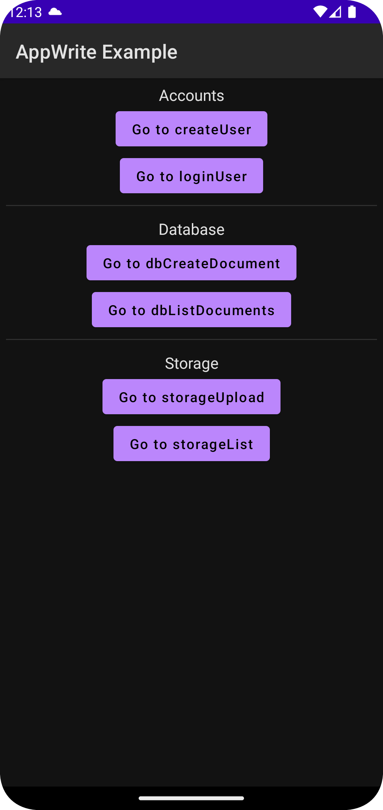

<br>

# Programs

- [AppWrite](https://appwrite.io/) (Obviously)
- [Docker](https://www.docker.com/products/docker-desktop/)

# Application dependencies

- AppWrite SDK (in the example below we will explain this)
- [Jetpack Compose Navigation](https://developer.android.com/jetpack/compose/navigation)
- [Koin](https://insert-koin.io/docs/setup/koin)

# How to use this repository

To start using this example we are going to need some programs, first of all please
install [Docker](https://www.docker.com/products/docker-desktop/)
why this? AppWrite recommends to use this because they provide a complete container image ready for
use.

When Docker installation is ready, please use this command line:

## For Unix based systems:

```
docker run -it --rm \
    --volume /var/run/docker.sock:/var/run/docker.sock \
    --volume "$(pwd)"/appwrite:/usr/src/code/appwrite:rw \
    --entrypoint="install" \
    appwrite/appwrite:1.2.1
```

## For Windows:

### CMD

```
docker run -it --rm ^
    --volume //var/run/docker.sock:/var/run/docker.sock ^
    --volume "%cd%"/appwrite:/usr/src/code/appwrite:rw ^
    --entrypoint="install" ^
    appwrite/appwrite:1.2.1
```

### PowerShell

```
docker run -it --rm `
    --volume /var/run/docker.sock:/var/run/docker.sock `
    --volume ${pwd}/appwrite:/usr/src/code/appwrite:rw `
    --entrypoint="install" `
    appwrite/appwrite:1.2.1
```

When docker installation finish, the command line will ask you for some basic configuration, in my
personal case
i used the standard but i changed the HTTPS port from 443 to 4433, this is important because as we
know, Android doesn't
make HTTP request to not HTTPS endpoints.

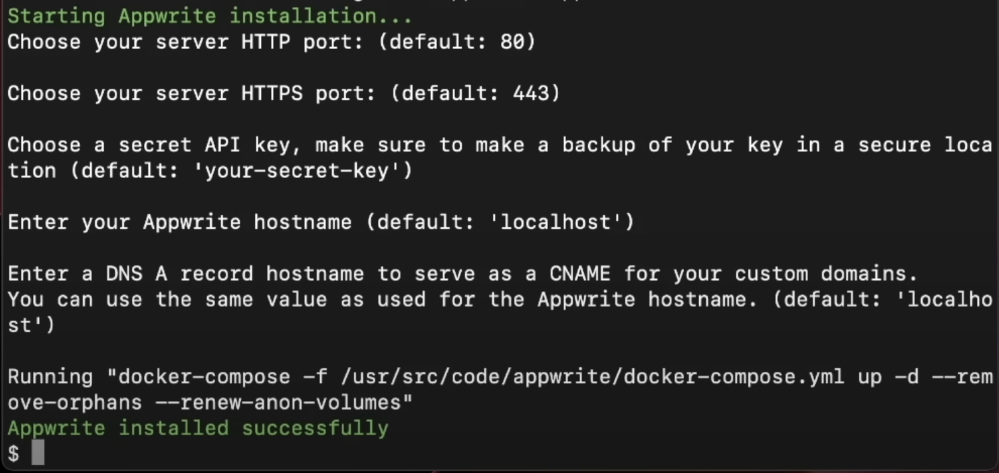

After the installation if everything is ok you can access to the website on your localhost service:

```https://localhost:YOUR HTTPS PORT HERE/login```

> In my example i used a local IP address because this was mounted in an external PC.

If everything goes well you will see this landpage:

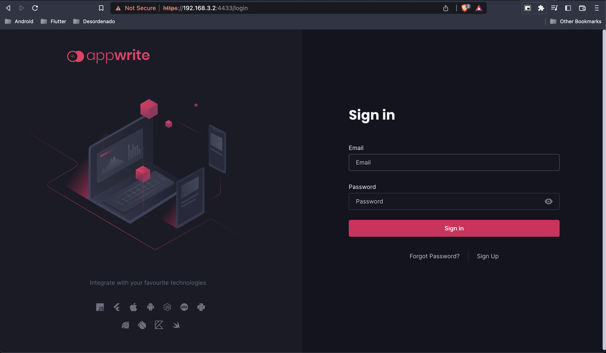

Now we need to create an account to start developing in this platform, click on **Sign Up**

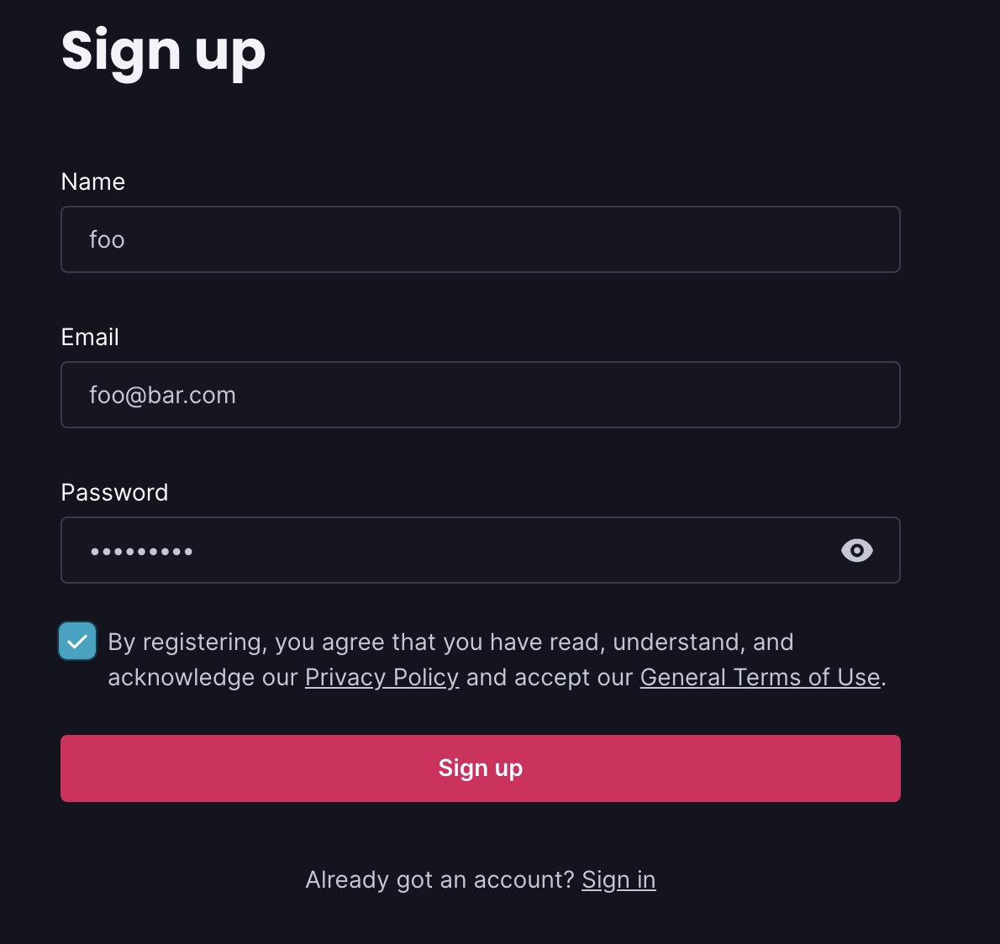

Fill everything, is not mandatory to create an account with real data, you could use something like:

- User: foo
- Email: foo@bar.com
- Password: foobarbaz

(Just for developing purposes, if you want to use your container in production use something more
clever xD)

In first instace, AppWrite will ask to us the name of our project. in this case we will name it
as **appwriteExample**

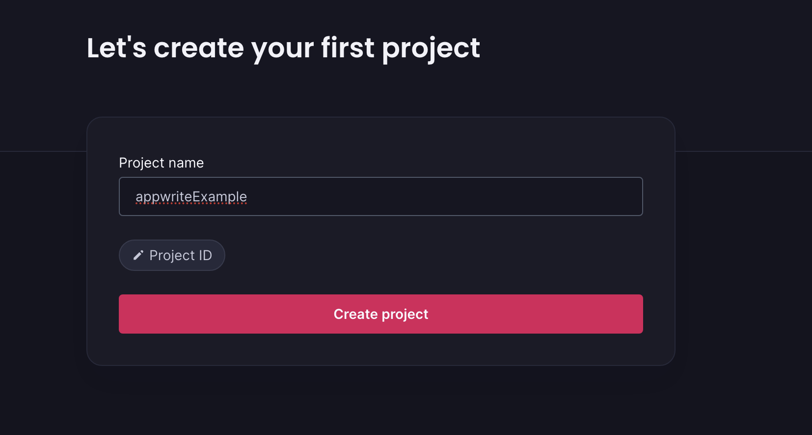

When the project is created we will see this dashboard:

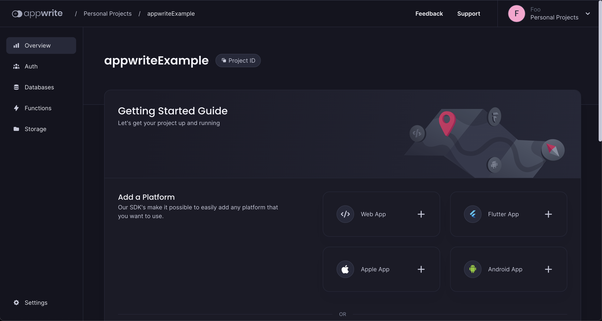

And now we can start our Android Project, but first! we need to add our platform, in our case we
need to add the **Android Platform**

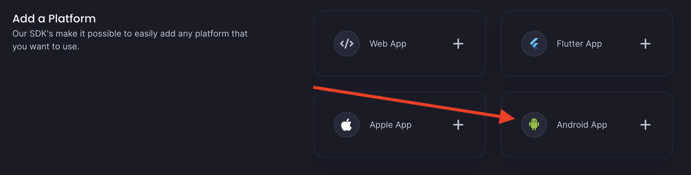

What I recommend on this point? simple, create an Android project because AppWrite will ask some
info about our project, in my example i will use the same data of this repository.

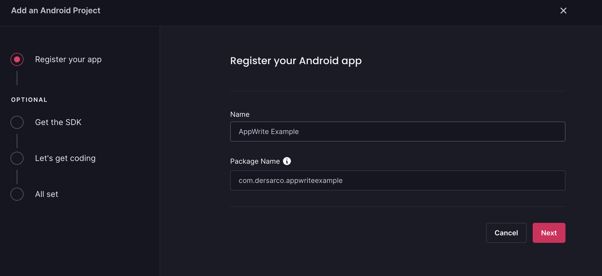

Click on **Next** and start with the recommended config on our Android project

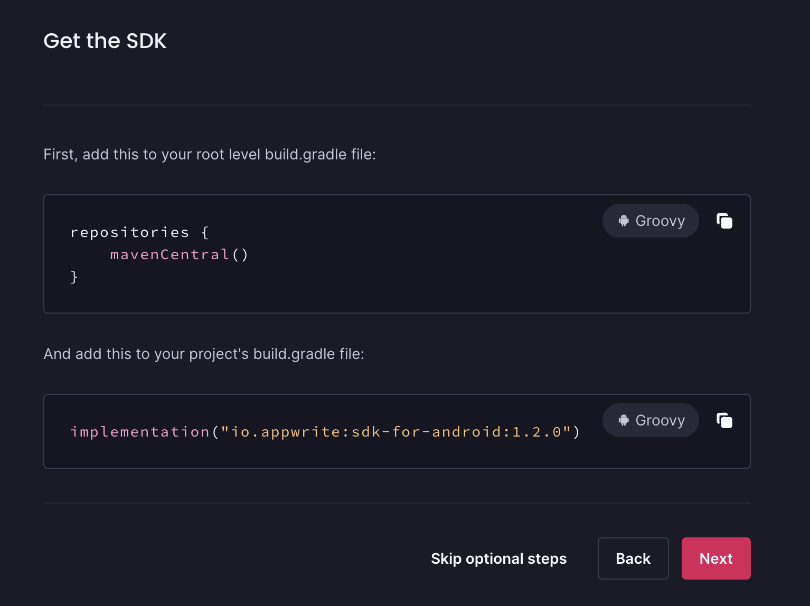

Add this dependencies in your Android project (mavenCentral in the most of the cases is declared so
maybe is not necessary to redeclare. If you have doubts you can check it in settings.graddle)

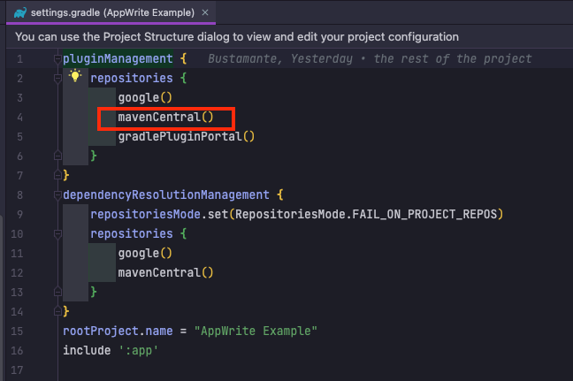

add the dependency in build.gradle and sync your project

```Gradle
    def appWrite_version = "1.2.0" // current version at this date
    
    implementation "io.appwrite:sdk-for-android:$appWrite_version"
```

AppWrite recommend us this piece of code to start building our application but we are going to skip
this because in this repository we will work in a different way with this piece of code.

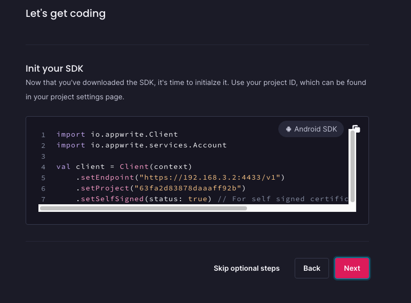

Click on next and we are going to see this screen.

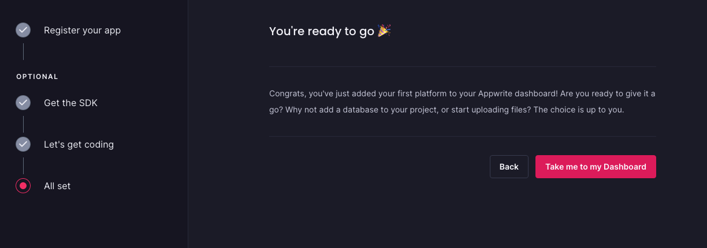

And that's it!, press on **Take me to my Dashboard**.

Once we finish with this configuration our AppWrite backend is ready to go with our Android app. BUT
first we need to make some little configurations in our Android app.

As I mention before we added the SDK dependency but we need to add this piece of XML code in our **
manifest.xml** inside of **application tag**

```XML
  <!--This is from documentation, on android:scheme add your project id from AppWrite-->
<activity android:name="io.appwrite.views.CallbackActivity" android:exported="true">
    <intent-filter android:label="android_web_auth">
        <action android:name="android.intent.action.VIEW" />
        <category android:name="android.intent.category.DEFAULT" />
        <category android:name="android.intent.category.BROWSABLE" />
        <data android:scheme="appwrite-callback-REPLACETHIS" />
    </intent-filter>
</activity>
```

We need to change a little this code, on **REPLACETHIS** we need to add our project ID from
AppWrite, and where is that thing? well is very easy to find, in our AppWrite project dashboard we
will see this little button where we can't see directly the id but it automatically copy the id to
our clipboard.

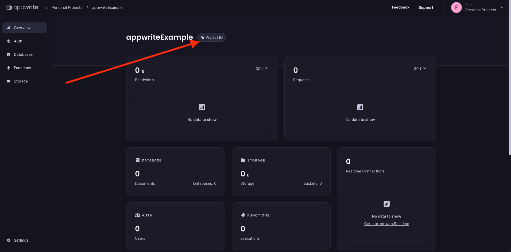

paste the ID in **REPLACETHIS** and **manifest file** will be ready.

forget to mention, but is important, **add internet permissions in manifest as well**

> If you forked this repo is not necessary is already added the permission 🙂

Other configuration that we need is in AppWriteInstance class, you could find this class
into `app/src/main/java/com/dersarco/appwriteexample/appwrite`

There is two variables you need to change for your own values

``` Kotlin
class AppWriteInstance(context: Context) {
    private val client = Client(context)
        .setEndpoint(ENDPOINT_URL)
        .setProject(PROJECT_ID)
        .setSelfSigned(true)

    fun getClient(): Client = client
}

// Replace this with your own project id and API url
private const val PROJECT_ID = "63f8c4cc0a8c1a64b76f"
private const val ENDPOINT_URL = "https://192.168.3.2:4433/v1"
```

Now with this config you are ready to start using this repo and watch how everything works.

# Configs per each functionality

## Login/Create Accounts

For login and create users we don't need any specific configuration but if you want to learn more
about this functionality you can check
it [here](https://appwrite.io/docs/client/account?sdk=android-kotlin)

## Database

For database ussage we need to config a database in our AppWrite dashboard, for this we need to go
to our Project Dashboard and press the Database on the menu of the left, once we are there press
on **Create Database** and choose a name, in my example i used a very creative name -> **mydb**.
Press create and we will have a database.

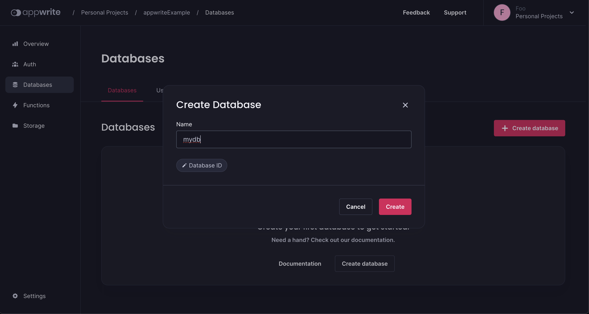

In our Database we need to create a collection, this works like Firebase Storage, with collections
and documents, so now we need to create a Collection, press on **Create Collection** and like before
choose a name, for this example i used -> **mycollection**. Press create and we are ready with the
collection.

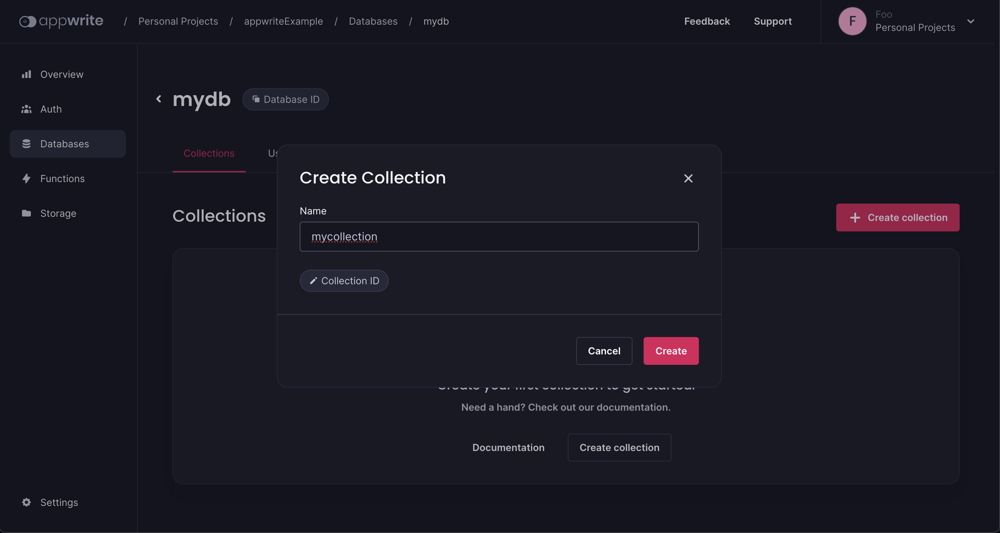

Ok, we are almost ready, after start using the database we need to make a few things, first of all,
in our collection we need to create attributes to start store documents in this collection. In this
example we are going to create two attributes because is a example, but if you want to learn more
about collections and attributes you can check
this [link](https://appwrite.io/docs/client/databases?sdk=android-kotlin).

To create this attributes just press on **Create attribute** fill the fields with the info of that
attribute and create it.

Example fields:

- name: String
- age: Integer

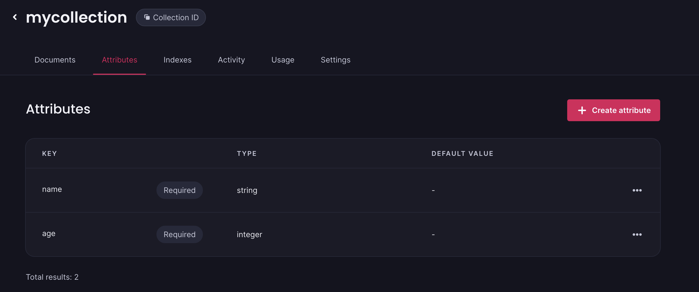

Now we need to configure the permissions of this collection, by default everything comes unabled, so
for this case we are going to configure on settings tab this collection like this:

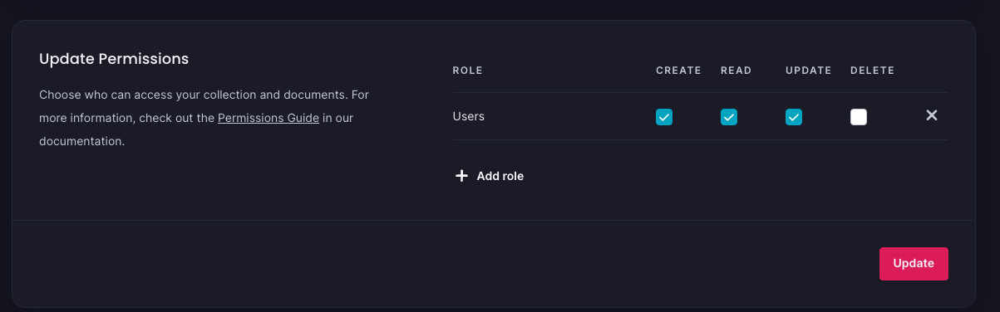

Just Users for this example, and remember to make a login on the Login Example Screen because we
need an instace of login to create documents.

Now we can move to the code, on AppWriteDatabase.kt we need to change this piece of code:

`app/src/main/java/com/dersarco/appwriteexample/appwrite/AppWriteDatabase.kt`

```Kotlin 
class AppWriteDatabase(private val context: Context, appWriteInstance: AppWriteInstance) {

    //Replace with your own id's from AppWrite database
    private object AppWriteDatabaseConstants {
        const val DATABASE_ID = "63fba37bbf99b2eae6fb"
        const val COLLECTION_ID = "63fba37f873c649fbdf8"
    }

    ///...
}
```

And now, where are this famous Id's? in you database and collection dashboard you could find this
button, works the same way as the button of Project Dashboard

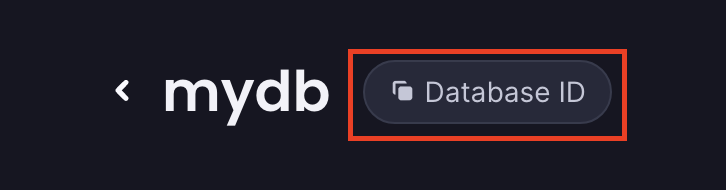 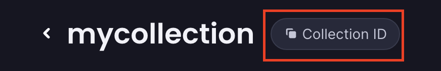

Now we are ready to go with this example, you can play as you want with the code and try new things.

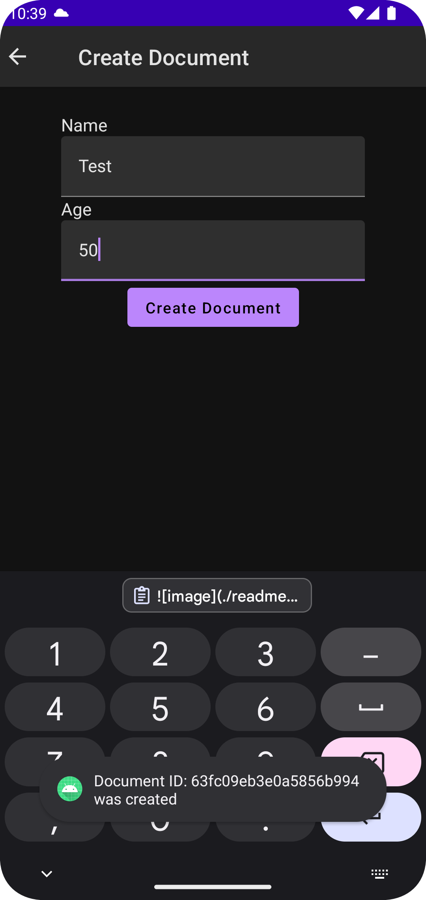

> Be careful, and don't try to add a document with empty fields, maybe the app will crash, i'll take care of this later 😅.

You also can watch your documents parsed in a Lazy Column in other view that i created for this
purpose.

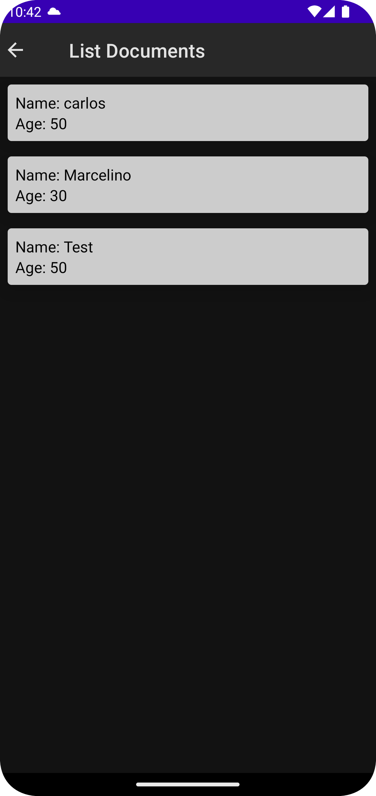

## Storage

Now we are going to watch how to work with Storage in AppWrite, first of all, Storage works almost as Firebase Storage, in our example we are going to upload images and retrieve the image data and show it into a list.

For this we need to go to our Storage Dashboard an click into **Create bucket** like the previous examples we need to choose an awesome naem, for this example the name will be **mybucket** very creative... Press on **Create** and our bucket is ready.

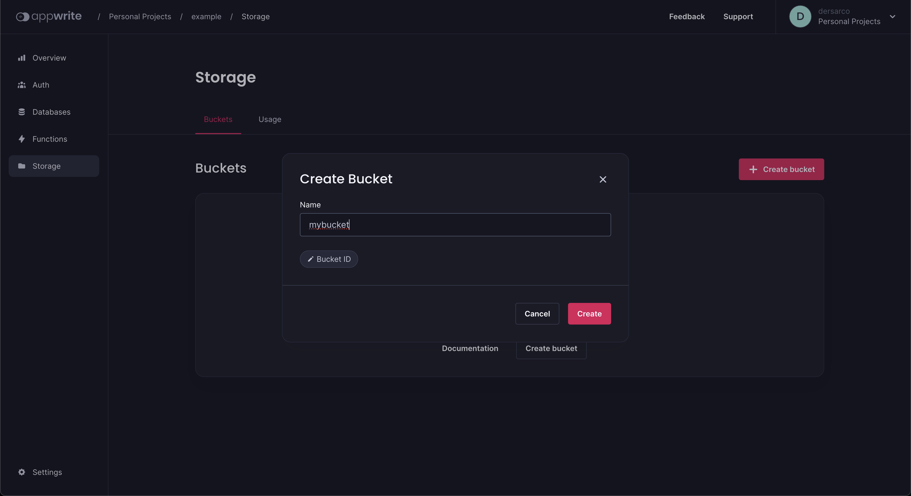

Storage comes by default without any configuration, so we need to configure a little our bucket, go to the settings tab and configure your bucket like this (This configuration is just to make our example app works, if you want to try something else, please read the [documentation](https://appwrite.io/docs/client/storage))

The permissions needs to look like this:

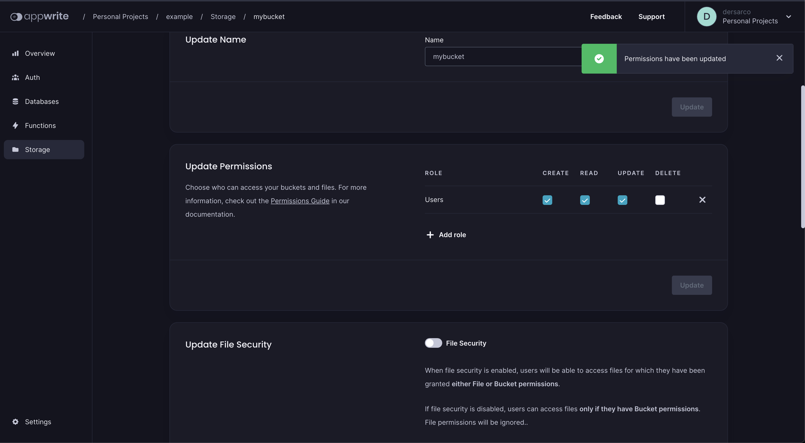

A little bit below of this permission configuration, exist another config related with authorized file extensions, in this case we need to add the extensions related with images, in my example i addded the most common image extensions, you can add others if you want. 

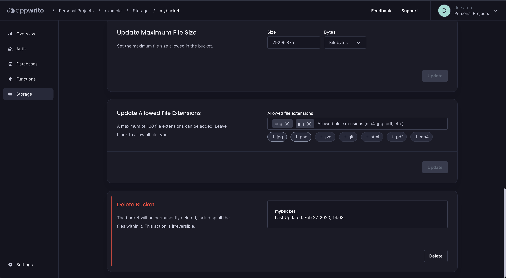

Well, now we have our Bucket ready to go!, but like the other examples we need to make a few changes in our code. Go to AppWriteStorage.kt and change the `BUCKET_ID` variable with your Bucket ID.

`app/src/main/java/com/dersarco/appwriteexample/appwrite/AppWriteStorage.kt`

```Kotlin 
class AppWriteDatabase(private val context: Context, appWriteInstance: AppWriteInstance) {
    ///...
}

// Change this ID for your own ID
private const val BUCKET_ID = "63fccb7b6230779b11b4"

```

Like the past example, you could find the Bucket ID at dashboard.

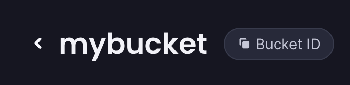

And now we are ready to go with the AppWrite Storage!. You could upload any image from your device and list it.

>The example only upload and show images, if you want to try another type of file, you will need to refactor the example code.

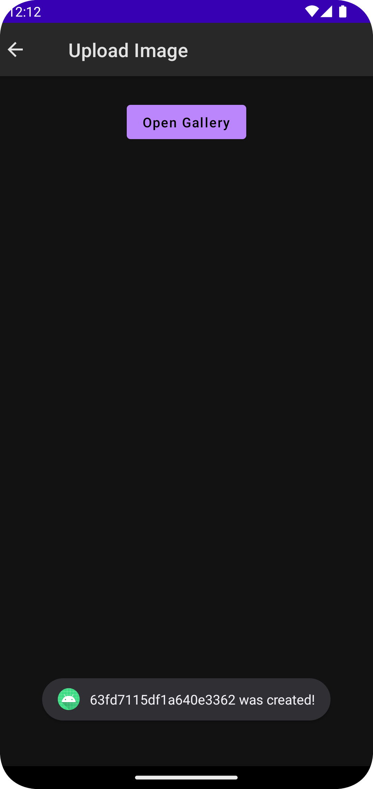
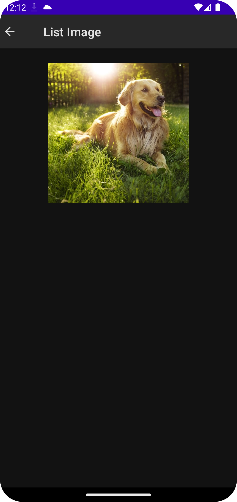
