# AppWrite App example

Welcome to this little [AppWrite](https://appwrite.io/) Example, i'm going to try to give you a few
code snippets focused on the most used features of any project. For example:

 - Login
 - User Creation
 - Database Usage
 - Image Storage
 - And many others...

# Programs
 
 - [AppWrite](https://appwrite.io/) (Obviously)
 - [Docker](https://www.docker.com/products/docker-desktop/)

# Application dependencies

 - AppWrite SDK (in the example below we will explain this)
 - [Jetpack Compose Navigation](https://developer.android.com/jetpack/compose/navigation)


# First steps

To start using this example we are going to need some programs, first of all please install [Docker](https://www.docker.com/products/docker-desktop/)
why this? AppWrite recommends to use this because they provide a complete container image ready for use.

When Docker installation is ready, please use this command line:

For Unix based systems:
```
docker run -it --rm \
    --volume /var/run/docker.sock:/var/run/docker.sock \
    --volume "$(pwd)"/appwrite:/usr/src/code/appwrite:rw \
    --entrypoint="install" \
    appwrite/appwrite:1.2.1
```

## For Windows:

### CMD
```
docker run -it --rm ^
    --volume //var/run/docker.sock:/var/run/docker.sock ^
    --volume "%cd%"/appwrite:/usr/src/code/appwrite:rw ^
    --entrypoint="install" ^
    appwrite/appwrite:1.2.1
```

### PowerShell
```
docker run -it --rm `
    --volume /var/run/docker.sock:/var/run/docker.sock `
    --volume ${pwd}/appwrite:/usr/src/code/appwrite:rw `
    --entrypoint="install" `
    appwrite/appwrite:1.2.1
```

When docker installation finish, the command line will ask you for some basic configuration, in my personal case
i used the standard but i changed the HTTPS port from 443 to 4433, this is important because as we know, Android doesn't
make http request to not https endpoints.


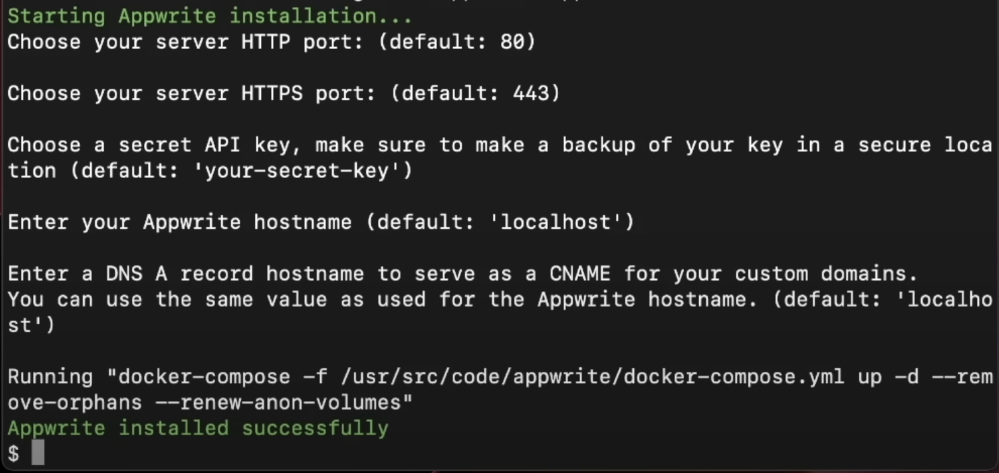


After the installation if everything is ok you can access to the website on your localhost service:

**https://localhost:[YOUR HTTPS PORT HERE]/login)**

If everything goes well you will see this landpage:

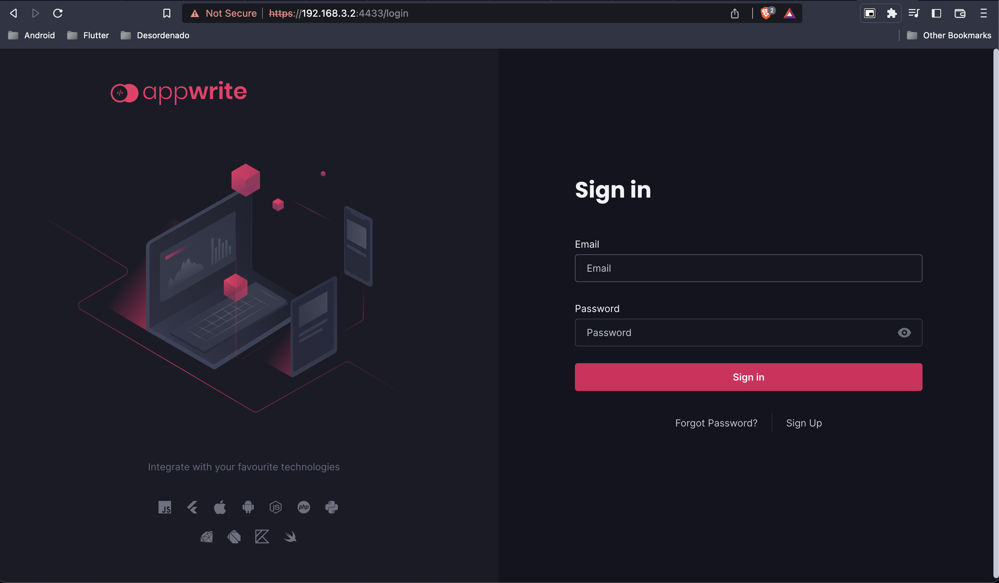

Now we need to create an account to start developing in this platform, click on **Sign Up**

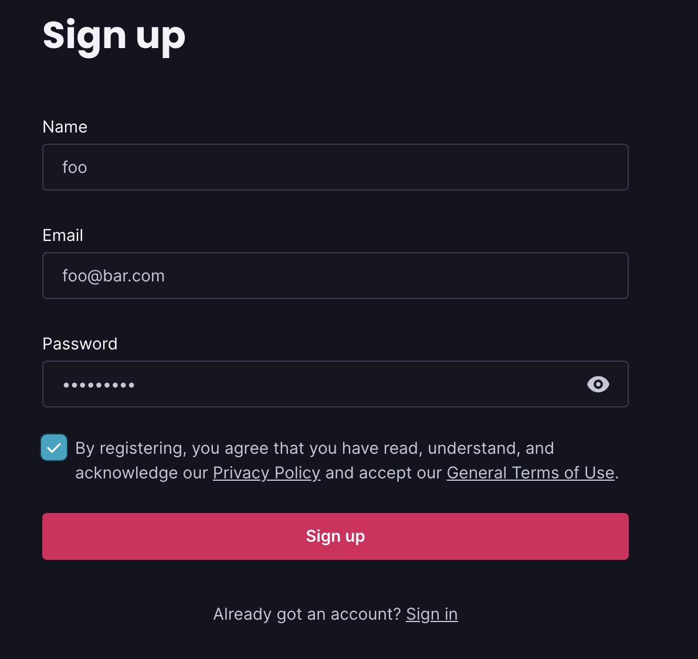

Fill everything, is not mandatory to create an account with real data, you coul'd user something like:

- User: foo
- Email: foo@bar.com
- Password: foobarbaz

(Just for developing purposes, if you want to use your container in production use something more clever xD)

In first instace, AppWrite will ask to us the name of our project. in this case we will name it as **appwriteExample**

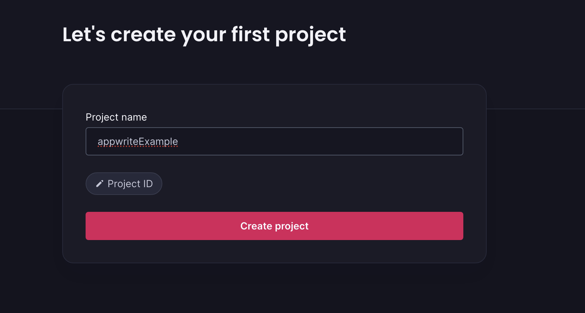

When the project is created we will see this dashboard:

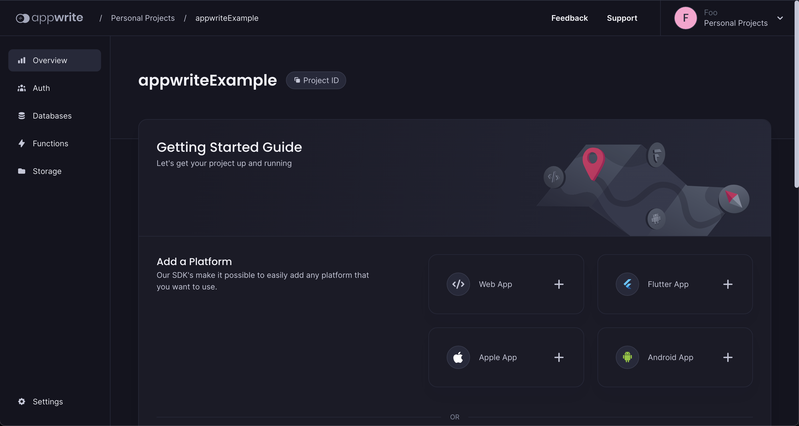

And now we can start our Android Project, but first! we need to add our platform, in our case we need to add the **Android Platform**

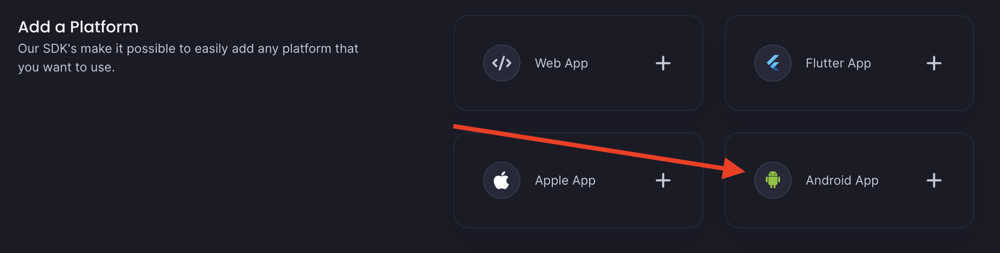

What i recommend on this point? simple, create an Android project because AppWrite will ask some info about our project, in my example i will use the same data 

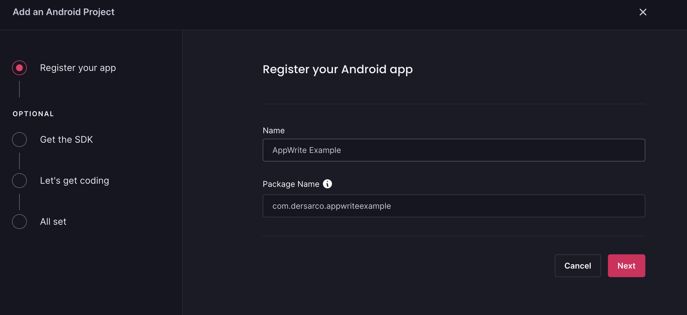

Click on **Next** and start the recommended config on our project

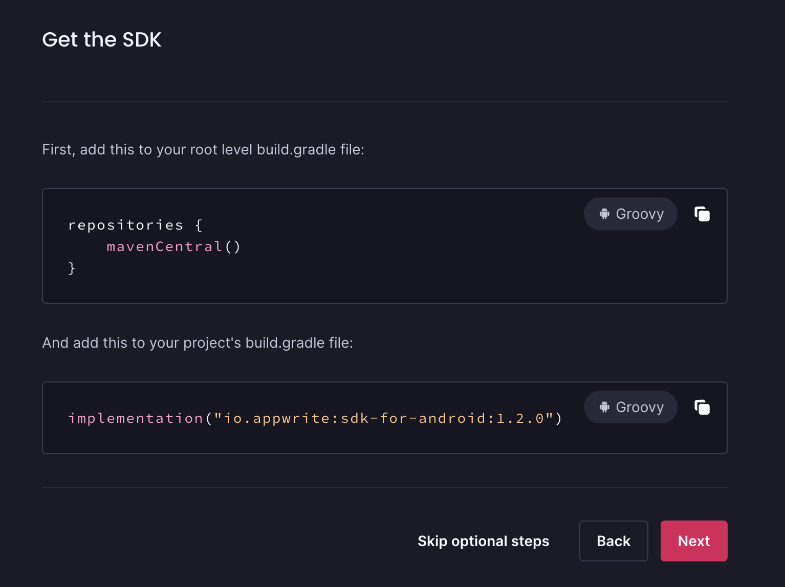

Add this dependencies in your project (mavenCentral in the most of the cases is declared so maybe is not necessary to redeclare. If you have doubts you can check it in settings.graddle)

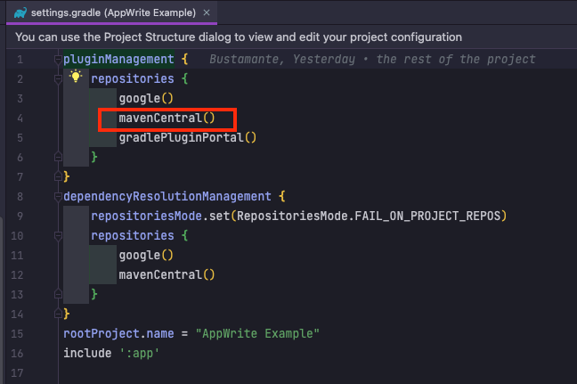

add the dependency in build.gradle and sync your project

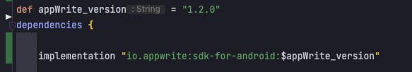

AppWrite recommend us this piece of code to start building our application but we are going to skip this because in this project we work in a different way this recommendation.

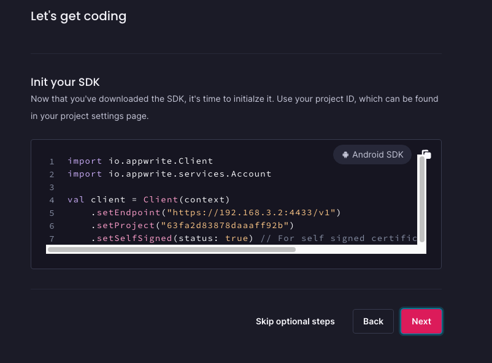
